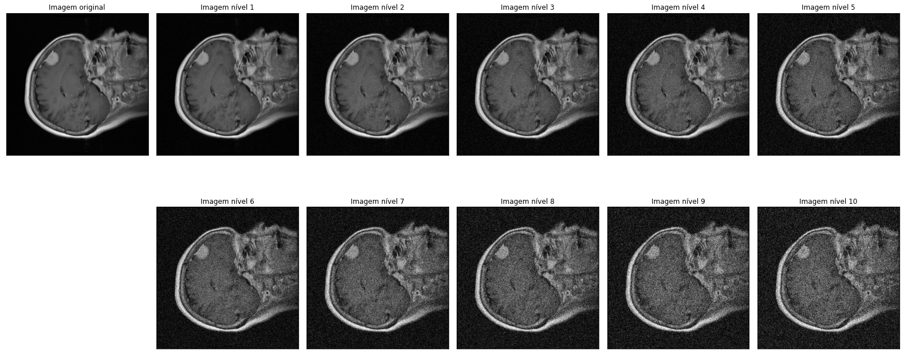

# Gaussian Noise


A statistical noise based on the normal distribution. Generated using the `random_noise` function, available in the skimage library, alternating the variance to produce different levels of noise.

Example python code:

```Python
def generate_ruido_gaussiano(img, deg_level):
    #Noise Levels
    sigmas=np.linspace(1,10,10)/40
    return to_0255(random_noise(img,var=sigmas[deg_level-1]**2))
```