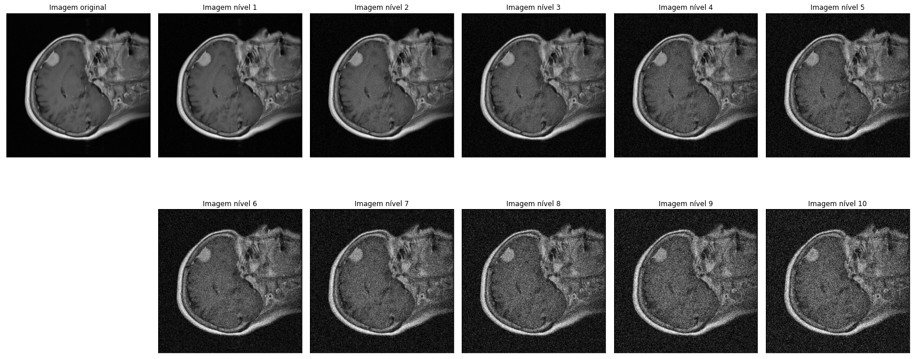

---
# generation
layout: default
title: Artifact Generation
nav_order: 2
has_children: true
permalink: docs/generation
---

# Artifacts

<!-- Brief description of the types of generations that will be covered.
{: .fs-6 .fw-300 } -->

## MRI

MRI scans can have a wide variety of artifacts, those can happen by hardware faults, software limitations, human error while handling the scan equipment or even be patient-related like involuntary or voluntary motions ([Radiopedia article on mri artifacts](https://radiopaedia.org/articles/mri-artifacts-1)).

Deep learning has already proven to be an interesting approach in solving problems involving MRI scans (including the brain ones we're interested), but most of those studies have been done on curated datasets where those artifacts are either not present or have very low presence. Our objective is to test the effectiveness of the commonly used deep learning models when they're exposed to such artifacts in different ways.

Obtaining general brain MRI datasets has proven to be quite the difficult task already, so you can imagine obtaining big enough datasets containing the specific artifacts we want to study would be even more complicated. To approach this problem, we decided to artificially generate those datasets.

## Artifact generation functions

A python functions for each of the chosen artifacts was created. These functions take an image (expected to be single channel with `[0-255]` intensity range) and a degradation level. `deg_level` must be an integer between 1 and 10.

1 means a very low degradation or a level where the artifact is barely noticeable. 10 means that it's a very high degradation, where the artifact is super noticeable to the level where the image quality is terrible and such scan probably would never be used in a real diagnose (it's could still be interesting to look at what's the impact of such artifact in deep learning models, that's why we kept them).

Bellow an example of the variation between the original image and the 10 levels of degradation of the artifact *Gaussian Noise*:

*Open in another tab to see full image quality.*

## Disclaimer about degradation levels

It's important to note that the 10 levels of the selected artifacts aren't to be considered the same amount of degradation. What we mean by that is that a level 5 of *Ringing* does not necessarily have the same "strength" as a level 5 of *contrast*. The scales were chosen arbitrarily using the human eye of some of our researchers, aiming to have a barely noticeable artifact at level 1 and a very noticeable artifact that really affects the image quality at level 10.

Using image quality metrics like PSNR or MSE could be one approach to uniformize the level scale between different artifacts. Our initial tests have shown that some artifacts have more impact to these metrics than others, so we decided to keep the arbitrary scales for the time being.

TODO: Calculate PSNR results and add here.

This means that the levels shouldn't be used alone to understand an artifact impact in the obtained results, it's also important to actually look at the generated images to get the full picture of the results.
