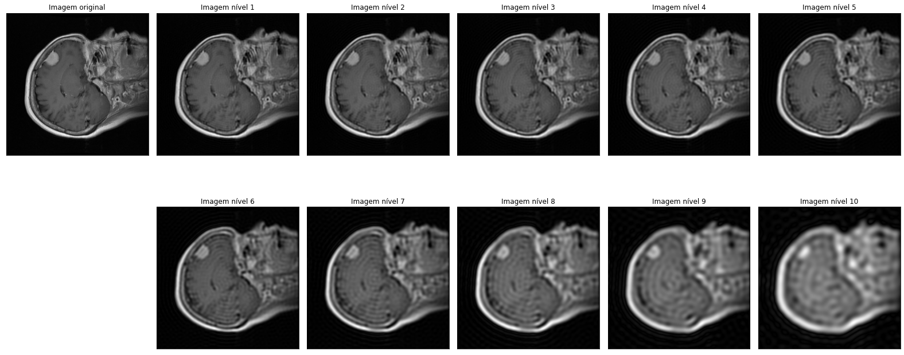

# Ringing
{: .no_toc }

The ringing artifact also known as Gibbs artifact or truncation artifact refers to a series of lines parallel to abrupt and intense changes to an object, in our case especially around the brain skull.

To generate these artifacts we use frequency domain filtering, using the fourier transform  available in the opencv2 library. We create circular mask with different sizes and apply them into the frequency domain version of the brain image. A bigger radius mask will generate lesser ringing effects while a small radius will generate greater ringing, but will also throw away more information and look very degraded.

Here we have a link to a [jupyter notebook](https://drive.google.com/file/d/1s6KwHVKDCLFJTlwh7PDBxq43bFBnR_Bf/view?usp=sharing) explaining the generation process step by step.

[Radiopedia article](https://radiopaedia.org/articles/gibbs-and-truncation-artifacts?lang=us) about this topic.
